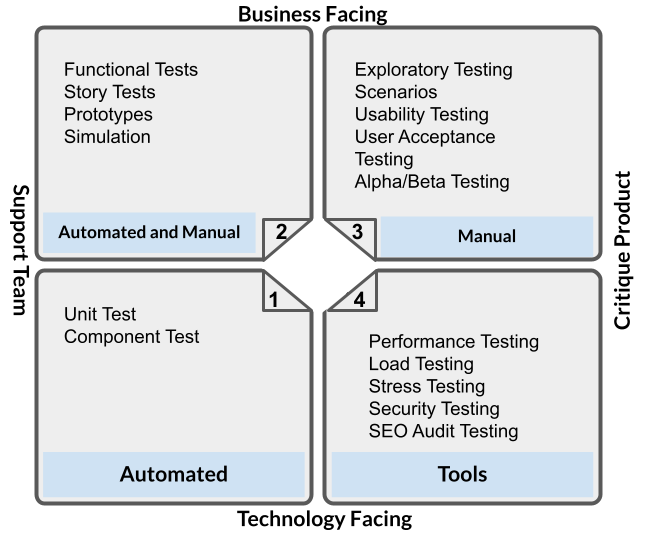
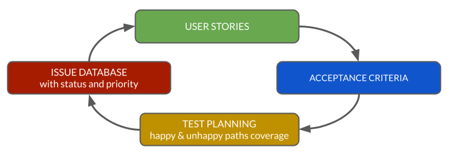

Testing software is one of those tricky activities that seem easy at first, but you can quickly get into a rabbit hole if you don't know what you are doing.

All apps have lots of bugs, even if you are the most brilliant developer on earth. Senior developers understand that statement, and that's why they get obsessed with doing everything they can to implement best practices and prevent bugs.

## Types of testing



There are so many different ways something may go wrong.  
Companies have big teams with dozens of people behind the quality teams because thorough testing is complicated. 

We don't recommend doing all types of testing; when applications are over-tested, the development cycle is slow because you have to run all these tests every time the software is compiled or published.

Thru the past 10 years these are the following types of tests that have been developed:

- Functional Test
- Story Testing
- Prototype
- Exploratory Testing
- User Acceptance
- A/B Testing
- Unit Testing
- Component Testing
- Perfomance Testing
- Stress Testing
- Security Testing
- SEO Testing

We will focus on two types of testing: **Unit Testing** and **Story Testing** as we consider those 2 the most important ones and, in some times, more than enough to ensure a reliable application.

## What are the challenges when testing?

- Expectations: If requirements are unclear, it's easy to find unexpected behaviors in your software; you need to sit down and write user stories with clear acceptance criteria.
- Testing for happy paths is a trap; usually, "happy paths" are less buggy because everything thinks about them all the time. Make a significant effort to think and include all edge cases and errors.
- Acceptance criteria: Common sense is the least of all; instead of thinking that everyone is on the same page about a feature, it is better to write down when each feature is working correctly.
- Too many features to test: For each application feature, there is an average of 4 tests; if you have 5 features (like login, logout, signup, etc.), we are already talking about 20 tests. As you can imagine, the list gets a bit long: There needs to be a test plan with clear test paths and deep coverage.
- Too many bugs to track: You will be impressed by how many bugs you can find on a small app. It's easy to lose track of everything that was reported and start missing or duplicating bugs.
- Too many bugs to fix: After having dozens of bugs, it's clear that they won't be fixed in one day. Set priorities and consider the time to fix them in your due date expectations.
- Reproducing bug: Morphy's law is in the air; you can feel it everywhere. The person who reports bugs is not the same as the person who fixes those bugs; that's why developers often have a hard time recreating the same conditions that triggered the bug. Whoever reports the bug needs to make sure to leave the "steps to reproduce" the bug.

## Steps to implement Story Tests



Write down all user stories and acceptance criteria before coding.
Make sure everyone agrees.
Setup a bug database with priorities and a Kanban board with status-based tracking.
Plan your tests.
Have a "bug report template"
Test for unhappy paths, errors and exceptions.

## Everything starts with user stories

According to the agile method, your application requirements start as "user stories". User stories are straightforward and plain-english ways to describe software functionalities.

For example: `As a student, I would like to deliver projects for review.`

Usually a user story can be structured like this:

```
As a [role], I can [feature] so that [reason]
```

You can read more about user stories [here](https://content.breatheco.de/en/lesson/user-stories-examples) and [here](https://www.softwaretestinghelp.com/user-story-acceptance-criteria/):

## Example bug report template

The following is an example template to fill; you don't have to use all the sections, but please make sure the bug you create has a concise and reproducible description that is easy to understand for everyone on your team:

```txt
**Describe the bug**
A clear and concise description of what the bug is.

**To Reproduce**
Steps to reproduce the behavior:
1. Go to '...'
2. Click on '....'
3. Scroll down to '....'
4. See error

**Expected behavior**
A clear and concise description of what you expected to happen.

**Screenshots**
If applicable, add screenshots to help explain your problem.

**Desktop (please complete the following information):**
 - OS: [e.g. iOS]
 - Browser [e.g. chrome, safari]
 - Version [e.g. 22]

**Smartphone (please complete the following information):**
 - Device: [e.g. iPhone6]
 - OS: [e.g. iOS8.1]
 - Browser [e.g. stock browser, safari]
 - Version [e.g. 22]

**Additional context**
Add any other context about the problem here.
```

## Recomended readings

- [How to write a good bug report](https://www.softwaretestinghelp.com/how-to-write-good-bug-report/)
